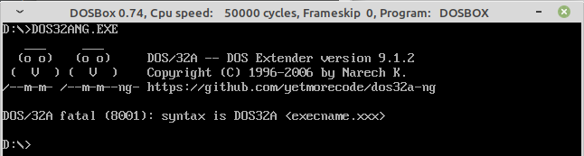

# DOS/32 Advanced DOS Extender (2021 next-gen!)
 
Happy hacking



## Building DOS/32A

With TASM 4+:

```
tasm32 /dEXEC_TYPE=0 /m /ml /c /la kernel.asm
tasm32 /dEXEC_TYPE=0 /m /ml /c /la dos32a.asm
tlink /3 dos32a kernel,DOS4GW.exe
```

From this repository (directly in dosbox):

```
mount d ~/git/dos32a-ng
D:
make.bat
```

:monocle_face:

With Docker:
Just run the following commands in the root directory of the repository. The container will launch a headless dosbox for building dos32a with tasm/tlink. After it finishes, a DOS32ANG.EXE will appear in the root directory.

```
$ docker build -t dos32a .
$ docker run -it -v ${PWD}/:/app/ dos32a --rm dosbox.sh
```

:sunglasses:

## Legacy version

Check other branches for legacy versions:

* 7.1.0 SDK with full documentation and build instructions
* 8.0.0 source with build instructions
* 9.1.2 source 
